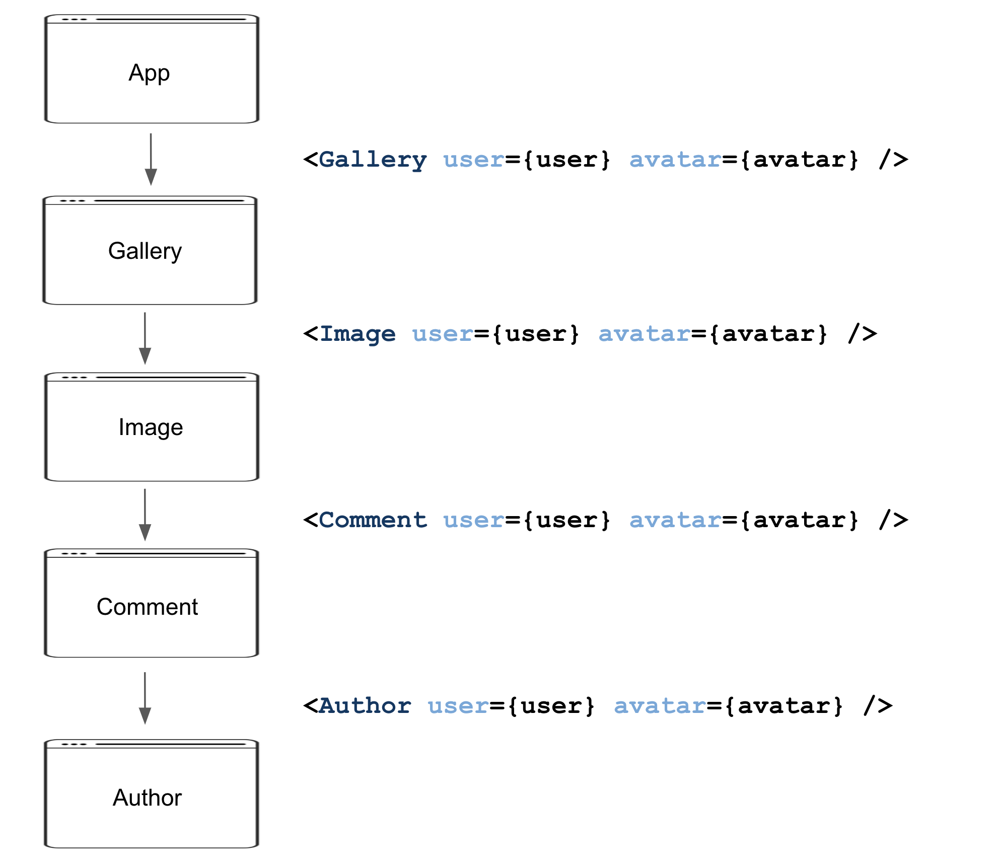

# React code smells

[tsevdos.me](https://tsevdos.me/) / [@tsevdos](https://twitter.com/tsevdos)

---

# Agenda

- Complex components
- Component and code duplication
- Not using the "derived state"
- Unhandled state and errors
- Components with too many props
- Prop drilling

---

# Rules

Feel free to interrupt me for:

- questions
- relevant comments

---

# Complex components

- != seperation of concerns
- != easy to reuse
- != good structure
- != predictable

---

# How to fix complex components

- split them in stateful and stateless components
- create flexible and re-usable components
- create re-usable hooks
- use contextAPI / global state (later Code example)

---

# Code example

---

# Component and code duplication

- bad abstractions
- not DRY
- adds complexity and bugs to our code
- not easy to refactor

---

# How to fix code duplication

- seperation of concerns
- build flexible and re-usable components
- re-usable helper functions

---

# Code example

---

# Use derived state

- easier to undestand code
- less side effects (useEffects) and state (useState)
- cleaner components

---

# Code example

---

# Unhandled state and errors

- avoid breaking / freezing the application
- provide a better and clearer UX
- give visual feedback to the user

---

# How to fix unhandled state and errors

- handle all posible errors (especially network errors)
- handle all state values

---

# Code example

---

# Components with too many props

- harder to read and maintain
- harder to compose

---

# How to fix components with too many props

- create and compose smaller components

---

# Prop drilling

---

# How to fix prop drilling

- react Context API
- global state (redux, recoil, zustand, jotai, MobX, etc.)

---

# Code example

---

# Recap

- Complex components
- Component and code duplication
- Not using the "derived state"
- Unhandled state and errors
- Components with too many props
- Prop drilling

---

# That's all folks

### Questions / Discussions?
