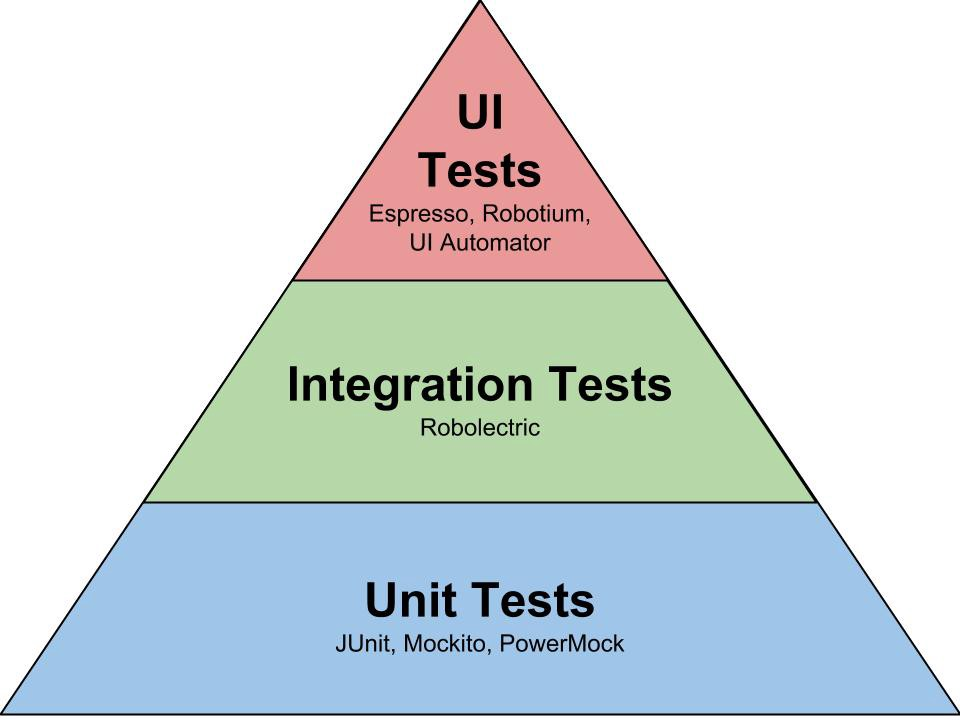
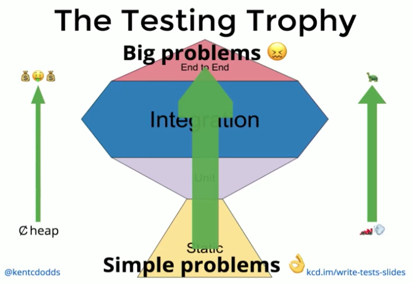
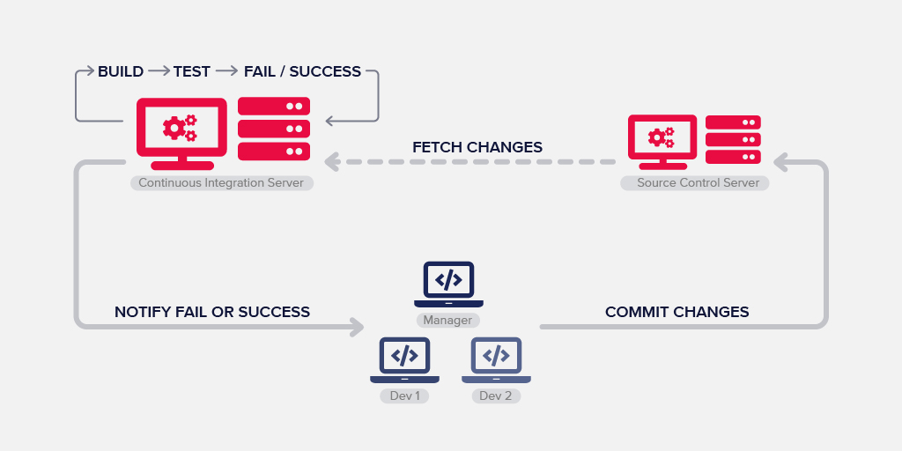

# JS testing

[tsevdos.me](https://tsevdos.me/) / [@tsevdos](https://twitter.com/tsevdos)

---

# Agenda

- what is testing
- js / node testing
- jest
- testing basics

---

# Rules

Feel free to interrupt me for:

- questions
- relevant comments

---

# Testing 101

- any QA / tester in the room?
- anyone who write tests?
- has anyone break a build?
- has anyone break the production?
- how much harm have you done to your company / users?

---

# Testing 101: why we test?

- confidence
  - prove our code works
  - refactoring / easier and faster additions / changes
- code quality and design
- documentation
- think about issues and edge cases
- reduce technical debt

---

# Types of tests

- unit tests: test one isolated unit / piece of code
- integration tests: test the combination of features
- end-to-end tests: test a full interaction path in your app

---

# Testing pyramid

---

# Testing Trophy

---

# Continuous Integration

---

# What CI does for us?

- detect and fix issues early (hopefully)
- avoid "integration hell"
- improve quality and testability
- continuous (automated) feedback
- code metrics
- increase transparency and communication
- running tests frequently
- confidence you’re building a solid solution

---

# Testing tools: Test runner

- executes tests and summarizes the results in the terminal
- Jest, Mocha, Jasmine, AVA, etc.

---

# Testing tools: Assertion library

- provide BDD and / or TDD styles for testing
  - it('works', () => { expect(2).toEqual(2); })
  - test('works', () => {expect(2).toEqual(2); })
- Jest, Chai, Jasmine etc.

---

# Jest

- not just a test runner
- super fast (runs tests in parallel using workers)
- built-in mocks and spies
- built-in code coverage report
- snapshot testing
- zero configuration
- many more...

---

# Usefull jest commands / flags

- `jest --watch`
- `jest --coverage`

---

# Writing Jest tests

1. TDD / BDD syntax
2. skipping tests
3. setup helpers

`./src/examples/00/writingTests.test.js`

---

# Jest matchers: core

[all matchers](https://jestjs.io/docs/expect)

- expect(value).toBe(value)
- expect(value).toEqual(value)
- expect(value).not.toBe(value)

---

# Jest matchers: strings

- expect(value).toMatch(regexpOrString)

---

# Jest matchers: numbers

- expect(value).toBeLessThan(number)
- expect(value).toBeLessThanOrEqual(number)
- expect(value).toBeGreaterThan(number)
- expect(value).toBeGreaterThanOrEqual(number)

---

# Jest matchers: booleans

- expect(value).toBeTruthy()
- expect(value).toBeFalsy()

---

# Jest matchers: objects

- expect(value).toBeInstanceOf(Class)
- expect(value).toMatchObject(object)
- expect(value).toHaveProperty(keyPath, value)

---

# Jest matchers: arrays

- expect(value).toContain(item)
- expect(value).toHaveLength(number)

---

# Jest matchers: misc

- expect(value).toBeUndefined()
- expect(value).toBeDefined()
- expect(value).toBeNull()
- expect(value).toBeNaN()

---

# Jest matchers: errors

- expect(value).toThrow(error)

---

# Jest matchers

`./src/examples/00/matchers.test.js`

---

# Unit testing phases

1. setup / arrange
2. act
3. assert
4. (teardown?)

---

# Unit test examples

- function `./src/examples/01/wordCount.js`
- class `./src/examples/02/Calculator.js`

---

# Unit test exercises

- function `./src/examples/03/isLeapYear.js` in order to pass all tests.
- test file `./src/examples/04/Person.js`

---

# Asynchronous testing

- async / await
- don't block the tests (especially the unit tests)

---

# Asynchronous testing examples

- function `todo`
- class `todo`

---

# Mocks and mocking

Mocking: The concept of mocking is primarily used in unit testing. You’d use mocking for isolating code by simulating the behavior of real objects and replacing the real object with the mocked object or function. For example, you can use a mock to make a function throw an error to evaluate how the function you’re testing handles this error.

---

# Spies and spying

Spying: A spy allows you to catch function invocations so you can later verify if the object got called with the right arguments. A spy won’t change the behavior of a function.

---

# Stubs and stubbing

Stubbing: Stubs are similar to spies. Instead of spying on a function, you can use a stub to control the behavior of a function. For example, a function makes an HTTP call to an external API. As you want predictable behavior for unit tests that don’t rely on unpredictable outcomes from an external API, we can stub the API call with a predefined value to make the test predictable again.

---

# Using mocks examples

- function `todo`
- class `todo`

---

# Mocks test exercises

- function `todo` in order to pass all tests.
- test file `todo`

---

# That's all folks

### Questions / Discussions?

<!--
# React testing library

- jest test runner
- render library
- testing components

---

# React testing library

A JS testing library, builds on top of [DOM Testing Library](https://testing-library.com/docs/dom-testing-library/intro/) by adding APIs for working with React components.

---

# React testing library

- plays good with jest test runner
- light-weight solution for testing
- works with any environment that provides DOM APIs

---

# Snapshot Testing

Snapshot tests are a very useful tool whenever you want to make sure your UI does not change unexpectedly.

---

# React testing

Examples 03 - 05

---

# Snapshots issues

- they fail on implementation details
- accidentally update snapshots (without really reviewing them)

---

# React testing library exercise

`(./app/examples/06/Input.test.js)`

- Write tests for this simple component

---

# End to end testing

- what is Cypress
- Cypress features
- what you can do with it

---

# What is Cypress

- end to end testing tool
- great features
- developer friendly
- easy to learn & setup

---

# Features: automatic waiting

- commands that make sence
- never add waits or sleeps to your tests
- waits for commands and assertions
  before moving on
- no more async hell

---

# Features: time travel

- snapshots as your tests run
- use the "command log" to see
  what happened at each step

---

# Features: the rest

- informative and intuitive debugging
- spies and stubs (you can even
  stub network traffic)
- screenshots and videos
- it's fast and live reloads
- many more...

---

# Cypress test runner

- electron app (UI mode)
- terminal (headeless mode)

---

# Supported browsers

- Electron (terminal)
- Chrome / Chromium (canary)
- Edge (beta and canary)
- Firefox (developer edition and nightly)
- Safari and Internet Explorer are not officially supported

---

# End-2-end tests demo

- run tests in terminal
- run tests UI
- have a look at the project

---

# Testing tools: e2e-testing tools

- act as a real user / browser
- Cypress, Playwright, Selenium, Puppeteer -->
